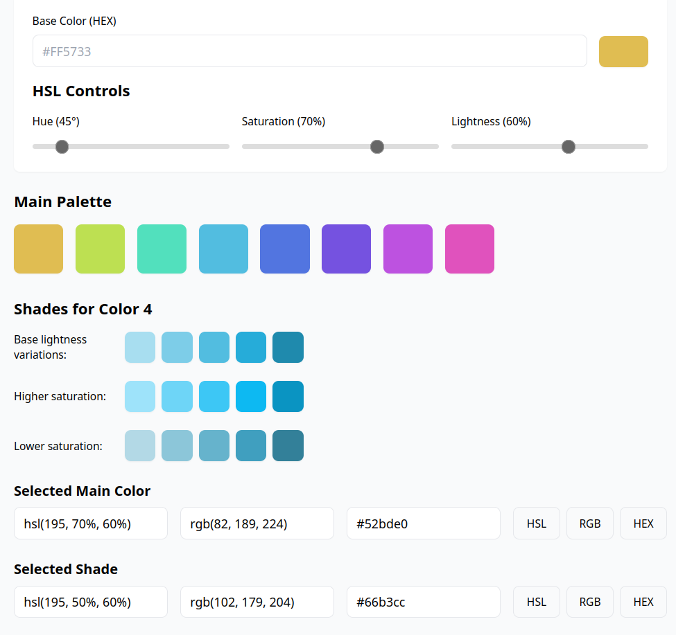

# HSL Color Palette Generator

An interactive color palette generator built with Vue 3 that helps create harmonious color schemes using HSL (Hue, Saturation, Lightness) color model. Perfect for designers and developers looking to create consistent and beautiful color palettes.

## 🎨 Features

- **Interactive HSL Controls**: Fine-tune your colors with precise control over Hue, Saturation, and Lightness
- **Smart Palette Generation**: Automatically creates harmonious color combinations
- **Multiple Color Formats**: Copy colors in HSL, RGB, or HEX format with one click
- **Shade Variations**: Generate and explore different shades for each color
- **Modern Tech Stack**: Built with Vue 3, TypeScript, and Tailwind CSS

## 🚀 Live Demo

Try it out: [HSL Color Palette Generator](https://geste-studio.github.io/color-palette-generator/)

## 🤖 AI Contribution

Approximately 95% of this project's code was generated by Claude 3.5 Sonnet (Anthropic) from a single paragraph of requirements sent by a designer via messenger. The AI assistance included:

- Complete Vue 3 component architecture
- Color conversion algorithms
- TypeScript interfaces and types
- Tailwind CSS styling
- GitHub Actions deployment configuration

The original requirement was to create a color palette generator that would:

- Take a base HSL color
- Generate harmonious colors by incrementing hue
- Create shade variations for each color
- Allow copying in different formats (HSL/RGB/HEX)

This showcases the potential of AI-assisted development while maintaining high code quality and proper typing. Only minor adjustments and optimizations were needed after the initial AI-generated codebase.

